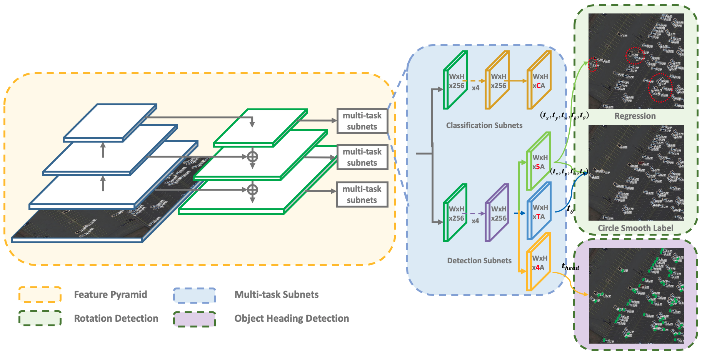
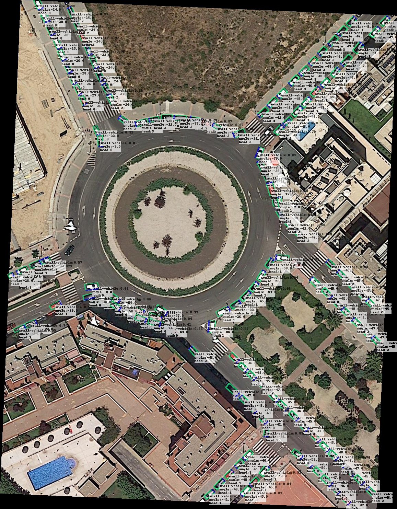
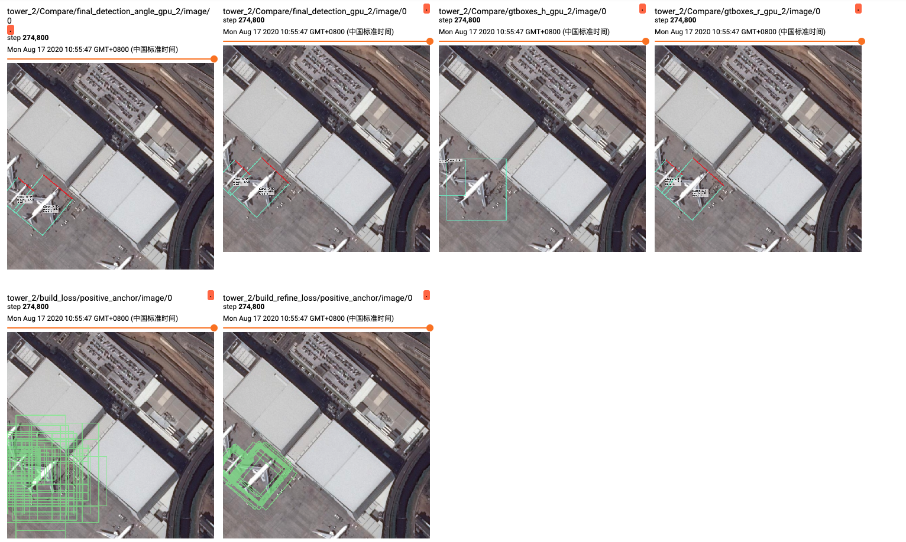
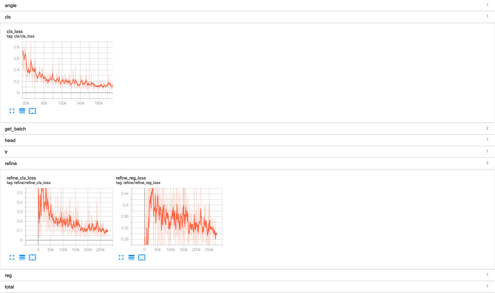

# Object Heading Detection

## Abstract
[OHDet]() can be applied to rotation detection and object heading detection. Its structure combines many of my previous research contents, including [R<sup>3</sup>Det](https://arxiv.org/abs/1908.05612), [IoU-Smooth L1 Loss](https://arxiv.org/abs/1811.07126), [CSL](https://arxiv.org/abs/2003.05597), etc.    
Project page at https://yangxue0827.github.io/CSL_GCL_OHDet.html

**We also recommend a tensorflow-based [rotation detection benchmark](https://github.com/yangxue0827/RotationDetection), which is led by [YangXue](https://yangxue0827.github.io/).**

## Pipeline
The figure below is the architecture of the proposed detector (RetinaNet as an embodiment).    
     


## Latest Performance
### OHD-SJTU-L
| Model | Model Link | PL | SH | SV | LV | HA | HC | AP<sub>50</sub> | AP<sub>75</sub> | AP<sub>50:95</sub> |  Configs  |  
|:------------:|:------------:|:------------:|:------------:|:---------:|:-----------:|:------------:|:------------:|:------------:|:---------:|:-----------:|:-----------:|   
|  [R<sup>2</sup>CNN](https://arxiv.org/abs/1706.09579) | - | 90.02 | 80.83 | 63.07 | 64.16 | 66.36 | 55.94 | 70.06 | 32.70 | 35.44 | - |
|  [RRPN](https://arxiv.org/pdf/1703.01086) | - | 89.55 | 82.60 | 57.36 | 72.26 | 63.01 | 45.27 | 68.34 | 22.03 | 31.12 | - |
|  [RetinaNet-H]((https://arxiv.org/abs/1908.05612)) | | 90.22 | 80.04 | 63.32 | 63.49 | 63.73 | 53.77 | 69.10 | 35.90 | 36.89 | [cfgs_res101_ohd-sjtu-all_v1.py](./libs/configs/OHD-SJTU/cfgs_res101_ohd-sjtu-all_v1.py) |
|  [RetinaNet-R]((https://arxiv.org/abs/1908.05612)) | | 90.00 | 86.90 | 63.24 | 86.90 | 62.85 | 52.35 | 72.78 | 40.13 | 40.58 | [cfgs_res101_ohd-sjtu-all_v2.py](./libs/configs/OHD-SJTU/cfgs_res101_ohd-sjtu-all_v1.py) |
|  [R<sup>3</sup>Det](https://arxiv.org/abs/1908.05612)  | | 89.89 | 87.69 | 65.20 | 78.95 | 57.06 | 53.50 | 72.05 | 36.51 | 38.57 | [cfgs_res101_ohd-sjtu-all_r3det_v1.py](./libs/configs/OHD-SJTU/cfgs_res101_ohd-sjtu-all_r3det_v1.py) |
|  OHDet (ours) | | 89.73 | 86.63 | 61.37 | 78.80 | 63.76 | 54.62 | 72.49 | 43.60 | 41.29 | [cfgs_res101_ohd-sjtu-all_r3det_csl_v1.py](./libs/configs/OHD-SJTU/cfgs_res101_ohd-sjtu-all_r3det_csl_v1.py) |

## Visualization


## My Development Environment
**docker images: docker pull yangxue2docker/yx-tf-det:tensorflow1.13.1-cuda10-gpu-py3**      
1、python3.5 (anaconda recommend)               
2、cuda 10.0                     
3、[opencv(cv2)](https://pypi.org/project/opencv-python/)       
4、[tfplot 0.2.0](https://github.com/wookayin/tensorflow-plot) (optional)            
5、tensorflow-gpu 1.13                              

## Download Model
### Pretrain weights
1、Please download [resnet50_v1](http://download.tensorflow.org/models/resnet_v1_50_2016_08_28.tar.gz), [resnet101_v1](http://download.tensorflow.org/models/resnet_v1_101_2016_08_28.tar.gz), [resnet152_v1](http://download.tensorflow.org/models/resnet_v1_152_2016_08_28.tar.gz), [efficientnet](https://github.com/tensorflow/tpu/tree/master/models/official/efficientnet), [mobilenet_v2](https://storage.googleapis.com/mobilenet_v2/checkpoints/mobilenet_v2_1.0_224.tgz) pre-trained models on Imagenet, put it to data/pretrained_weights.       
2、**(Recommend in this repo)** Or you can choose to use a better backbone (resnet_v1d), refer to [gluon2TF](https://github.com/yangJirui/gluon2TF).    
* [Baidu Drive](https://pan.baidu.com/s/1GpqKg0dOaaWmwshvv1qWGg), password: 5ht9.          
* [Google Drive](https://drive.google.com/drive/folders/1BM8ffn1WnsRRb5RcuAcyJAHX8NS2M1Gz?usp=sharing)      

## Compile
```  
cd $PATH_ROOT/libs/box_utils/cython_utils
python setup.py build_ext --inplace (or make)

cd $PATH_ROOT/libs/box_utils/
python setup.py build_ext --inplace

cd $PATH_ROOT/eval_devkit
sudo apt-get install swig
swig -c++ -python polyiou.i
python setup.py build_ext --inplace

```

## Train

1、If you want to train your own data, please note:  
```     
(1) Modify parameters (such as CLASS_NUM, DATASET_NAME, VERSION, etc.) in $PATH_ROOT/libs/configs/cfgs.py
(2) Add category information in $PATH_ROOT/libs/label_name_dict/lable_dict.py     
(3) Add data_name to $PATH_ROOT/data/io/read_tfrecord_multi_gpu_ohdet.py  
```     

2、Make tfrecord     
For OHD-SJTU dataset:      
```  
cd $PATH_ROOT/data/io/OHD-SJTU
python data_crop.py
```  

```  
cd $PATH_ROOT/data/io/  
python convert_data_to_tfrecord.py --VOC_dir='/PATH/TO/DOTA/' 
                                   --xml_dir='labeltxt'
                                   --image_dir='images'
                                   --save_name='train' 
                                   --img_format='.png' 
                                   --dataset='OHD-SJTU'
```      

3、Multi-gpu train
```  
cd $PATH_ROOT/tools
python multi_gpu_train_r3det_csl_ohdet.py
```

## Test
```  
cd $PATH_ROOT/tools
python test_dota_r3det_csl_ohdet.py --test_dir='/PATH/TO/IMAGES/'  
                                    --gpus=0,1,2,3,4,5,6,7  

cd $PATH_ROOT/eval_devkit
python OHD_SJTU_evaluation_OHD.py
``` 

**Notice: In order to set the breakpoint conveniently, the read and write mode of the file is' a+'. If the model of the same #VERSION needs to be tested again, the original test results need to be deleted.**      

## Tensorboard
```  
cd $PATH_ROOT/output/summary
tensorboard --logdir=.
``` 





## Citation

If this is useful for your research, please consider cite.

```
@article{yang2020on,
    title={On the Arbitrary-Oriented Object Detection: Classification based Approaches Revisited},
    author={Yang, Xue and Yan, Junchi and He, Tao},
    year={2020}
}

@article{yang2020arbitrary,
    title={Arbitrary-Oriented Object Detection with Circular Smooth Label},
    author={Yang, Xue and Yan, Junchi},
    journal={European Conference on Computer Vision (ECCV)},
    year={2020}
    organization={Springer}
}

@article{yang2019r3det,
    title={R3Det: Refined Single-Stage Detector with Feature Refinement for Rotating Object},
    author={Yang, Xue and Liu, Qingqing and Yan, Junchi and Li, Ang and Zhang, Zhiqiang and Yu, Gang},
    journal={arXiv preprint arXiv:1908.05612},
    year={2019}
}

@inproceedings{xia2018dota,
    title={DOTA: A large-scale dataset for object detection in aerial images},
    author={Xia, Gui-Song and Bai, Xiang and Ding, Jian and Zhu, Zhen and Belongie, Serge and Luo, Jiebo and Datcu, Mihai and Pelillo, Marcello and Zhang, Liangpei},
    booktitle={Proceedings of the IEEE Conference on Computer Vision and Pattern Recognition (CVPR)},
    pages={3974--3983},
    year={2018}
}

```

## Reference
- https://github.com/endernewton/tf-faster-rcnn   
- https://github.com/zengarden/light_head_rcnn   
- https://github.com/tensorflow/models/tree/master/research/object_detection    
- https://github.com/fizyr/keras-retinanet     


